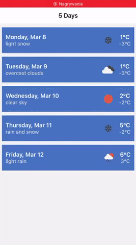
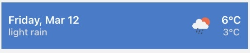
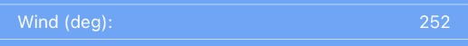
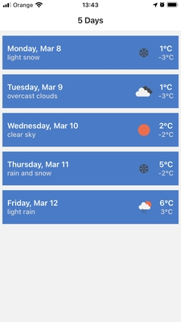
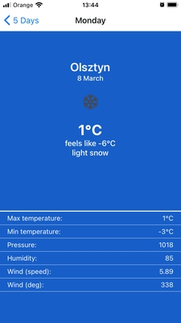
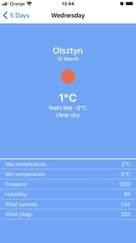

# WeatherApp

## Getting Started
This app is available on the [Expo](https://expo.io/ "Expo homepage") platform. After you have installed Expo onto your device you can building your own copy.

To build you own copy, clone this repository to your local machine and running `npm install`.

With Expo installed, you can then run `expo start` to launch the app.

Next scan QR Code on your device.

## Components
####`OneDayWeather`

####`DetailItem`

## Screens

####`FewDaysWeather`

####`WeatherDetails`

## Used API
[Open Weather Map](https://openweathermap.org/)

* City name by geographical coordinates - [Current weather data](https://openweathermap.org/current)
* Forecast weather data by geographical coordinates - [One Call API](https://openweathermap.org/api/one-call-api)
